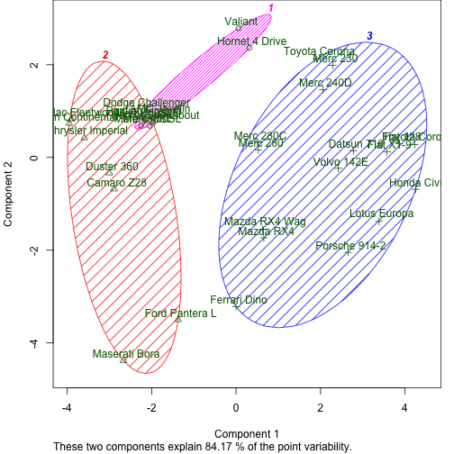
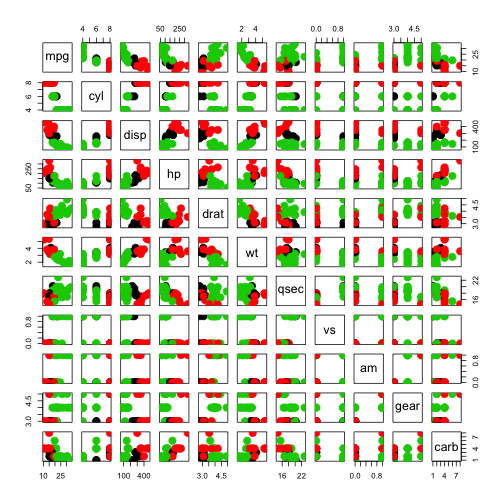

## Introduction
The purpose of this Shiny product is to produce an interactive web application to show the effect of variable selection and number of clusters have on K-means clustering and decrease the time of iteraction and data exploration.

## Data set used
The data set used is the Motor Trend Car Road Tests extracted from the 1974 Motor Trend US magazine. 

## Layout
The left hand side shows the inputs into the simulation. Users can select a number of variables to include in the clustering via the check boxes. Follow by choose the number of clusters. The right hand side shows the output graphs of the K-means cluster. The top graph is  a bivariate plot. All observation are represented by points in the plot, using principal components. The bottom graph is the variable relationship plot between every single variable selected in the input. Colour are used to represent the different clusters.

---

## Dynamic input 
Typically the process in determining the cluster, users have to evaluate different input variables and number of clusters to find the optimal K-mean cluster. What the Shiny application offers is drastic decrease in the time of interation and fast exploration of data.

```r
checkboxGroupInput("variable", "Variables to include",
                       c("Miles/(US) gallon" = "mpg", 
                         "Number of cylinders" = "cyl", 
                         "Displacement" = "disp", 
                         "Gross horsepower" = "hp",
                         "Rear axle ratio" = "drat",
                         "Weight (lb/1000)" = "wt",
                         "1/4 mile time" = "qsec",
                         "V/S" = "vs",
                         "Transmission" = "am",
                         "Number of forward gears" = "gear",
                         "Number of carburetors" = "carb")),
numericInput('clusters', 'Cluster count', 3,min = 1, max = 9)
```

---

## Instant evaluation
Once the variables are selected, the Shiny application will automatically generate the K-means cluster using dimension reduction. Users will be able to identify overlaps straight away. Note: the R codes shown above aren't the exact code used in the application. 

 

---

## Granular variable view
Users are also able to assess the relationship between the individual variables and clusters.
 
